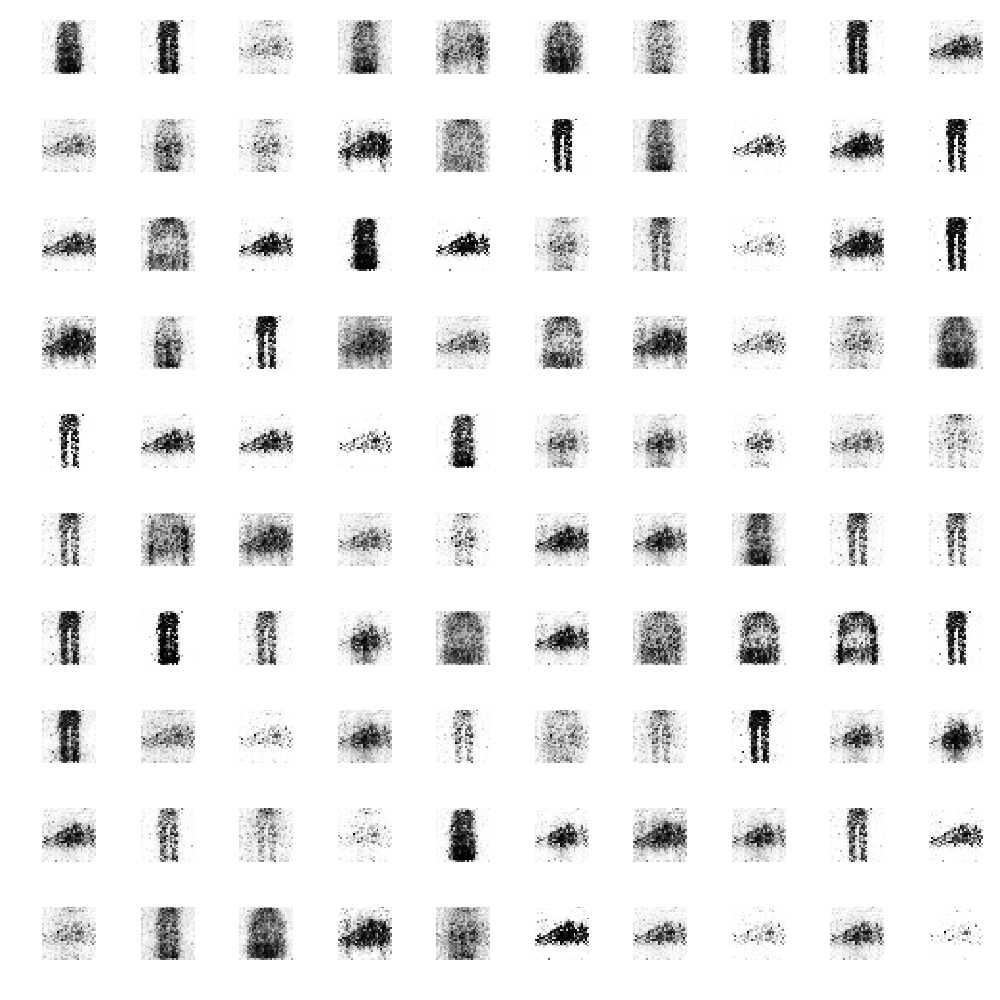
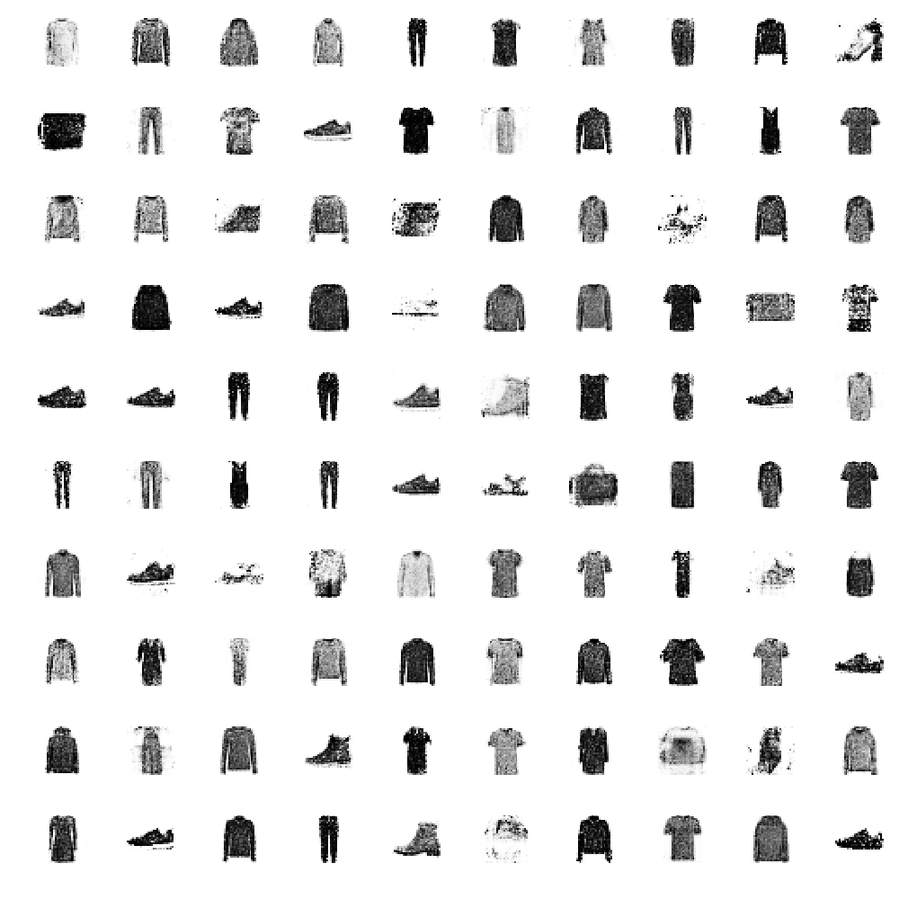
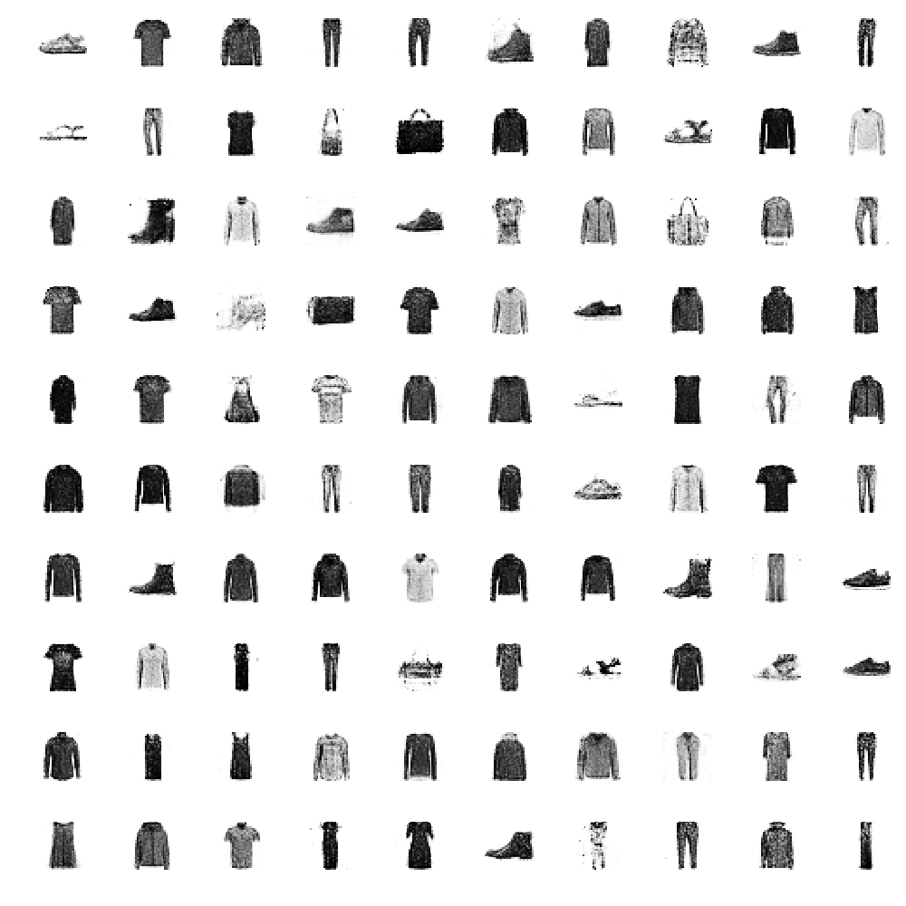

# SimpleGAN

Original implementation is provided with this link. 
[https://towardsdatascience.com/demystifying-generative-adversarial-networks-c076d8db8f44](https://towardsdatascience.com/demystifying-generative-adversarial-networks-c076d8db8f44)


## Setup

* Datasets
  * [zalandoresearch/fashion-mnist](https://github.com/zalandoresearch/fashion-mnist)

```csh
$ git clone https://github.com/satojkovic/SimpleGAN
$ cd SimpleGAN
$ wget https://raw.githubusercontent.com/zalandoresearch/fashion-mnist/master/utils/mnist_reader.py
$ python train.py
```

## Results

* Epoch 1
  

* Epoch 100
  

* Epoch 300
  
